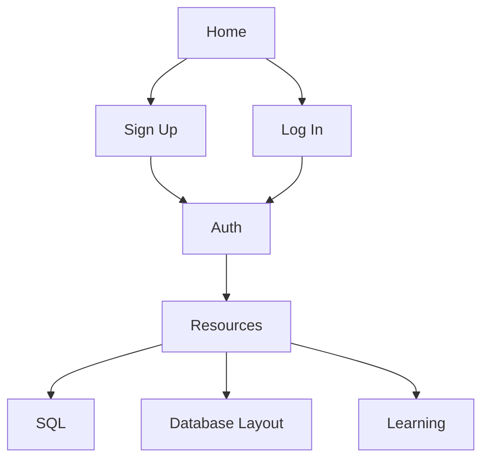

# Website Map



# Blocky

> A practical learning platform for understanding databases and SQL by building, querying, and reasoning about real data.

Blocky is a full-stack web application designed to make database concepts easier to learn and easier to apply. It is being built for solo developers, students, and IT learners who want a clear path from SQL fundamentals to confident database design.

The project combines guided learning with hands-on practice. Instead of treating SQL as a collection of commands to memorize, Blocky aims to help learners understand how data is structured, how queries work, and why database decisions matter in real applications.

## Audience

Blocky is designed for:

- **Solo developers** who want practical database skills for their own applications.
- **Students** learning relational databases, SQL, and backend development.
- **IT students and early-career technologists** building a strong foundation in data systems.
- **Curious learners** who prefer interactive examples over abstract documentation.

## Learning Goals

The platform is being shaped around a progressive learning path:

1. Understand tables, rows, columns, keys, and relationships.
2. Write and interpret essential SQL queries.
3. Filter, sort, group, and aggregate data.
4. Combine data with joins and subqueries.
5. Design reliable relational schemas.
6. Understand normalization, constraints, indexes, and transactions.
7. Practice reading query results and diagnosing mistakes.
8. Connect database knowledge to real backend applications.

## Current Stack

### Frontend

- React 19
- Vite
- JavaScript
- ESLint

### Backend

- Python
- Flask
- Flask application factory pattern
- Flask Blueprints
- Flask-CORS
- Flask-SQLAlchemy
- Flask-Migrate and Alembic
- `psycopg2-binary` for PostgreSQL connectivity

### Data

- Supabase PostgreSQL
- SQLAlchemy models and migrations

## Project Structure

```text
Blocky/
├── backend/
│   ├── app/
│   │   ├── app.py          # Flask application factory
│   │   ├── routes.py       # API Blueprint and route handlers
│   │   ├── models.py       # SQLAlchemy models
│   │   ├── extensions.py   # Shared Flask extensions
│   │   ├── config.py       # Environment-based configuration
│   │   └── cli.py          # Custom Flask CLI commands
│   ├── migrations/         # Alembic migration history
│   ├── requirements.txt
│   └── run.py              # Local development entrypoint
├── frontend/
│   ├── src/
│   ├── public/
│   ├── package.json
│   └── vite.config.js
├── .gitignore
└── README.md
```

## Getting Started

### Prerequisites

Install the following before starting:

- Python 3.11 or newer
- Node.js 20 or newer
- npm
- A Supabase project with a PostgreSQL connection string

### 1. Configure the backend

The backend reads configuration from the existing environment files in `backend/`. Keep credentials local and never commit them.

Required values include:

```env
DATABASE_URL=postgresql://...
SECRET_KEY=your-local-secret
CORS_ORIGINS=http://localhost:5173
```

The `DATABASE_URL` should be the PostgreSQL connection string provided by Supabase. For local development, use the connection option recommended by Supabase for your network and application setup.

### 2. Install backend dependencies

```powershell
cd backend
python -m venv .venv
.\.venv\Scripts\Activate.ps1
pip install -r requirements.txt
```

### 3. Run database migrations

```powershell
flask --app app.app:create_app db upgrade
```

To create a new migration after changing a model:

```powershell
flask --app app.app:create_app db migrate -m "describe the schema change"
flask --app app.app:create_app db upgrade
```

### 4. Start the Flask API

```powershell
python run.py
```

The API is available at `http://127.0.0.1:5000`.

### 5. Start the React frontend

Open a second terminal:

```powershell
cd frontend
npm install
npm run dev
```

The frontend is available at `http://localhost:5173`.

## API Foundation

The backend currently exposes a small API foundation through the `api` Blueprint:

| Method | Endpoint | Purpose |
| --- | --- | --- |
| `GET` | `/api/health` | Confirm that the API is available |
| `GET` | `/api/items` | Return stored items |
| `POST` | `/api/items` | Create an item |

The item routes are starter infrastructure for connecting the React client to the Flask API. They can be replaced or expanded as learning modules and database exercises are added.

The authentication Blueprint is available under `/api/auth`:

| Method | Endpoint | Purpose |
| --- | --- | --- |
| `POST` | `/api/auth/signup` | Create an account and start a session |
| `POST` | `/api/auth/login` | Sign in and start a session |
| `POST` | `/api/auth/logout` | Revoke the current session |
| `GET` | `/api/auth/me` | Return the current user |
| `GET` | `/api/auth/sessions` | List active tracked sessions |
| `PATCH` | `/api/auth/profile` | Update display name and theme |
| `POST` | `/api/auth/profile/avatar` | Upload a profile picture up to 2 MB |
| `POST` | `/api/auth/lessons/<lesson_id>/complete` | Complete a lesson and award one point once |
| `GET` | `/api/auth/progress` | Return completed lesson IDs and points |

Authentication uses Flask sessions, Werkzeug password hashing, and database-backed tracking. Failed login attempts are limited to five per hour for each email and IP address pair. The `SECRET_KEY` is read from the environment; when it is absent, development uses a value generated by Python's `secrets` module. Set a stable production secret in the environment so sessions survive restarts.

## Frontend Pages

The React client currently provides:

- A login and signup experience connected to the Flask auth API.
- An SQL learning page available through the `Explore SQL` link or the `#sql` URL hash.
- A progressive lesson rail with query examples, result previews, and a PostgreSQL Windows x64 setup guide.

## Development Commands

From `frontend/`:

```powershell
npm run dev       # Start the Vite development server
npm run lint      # Run ESLint
npm run build     # Create a production build
npm run preview   # Preview the production build locally
```

From `backend/` with the virtual environment active:

```powershell
python run.py                                      # Start Flask directly
flask --app app.app:create_app routes               # List registered routes
flask --app app.app:create_app db current           # Show migration state
flask --app app.app:create_app db upgrade           # Apply migrations
```

## Design Principles

Blocky is guided by a few practical principles:

- **Learn by doing:** every concept should lead to a query, schema, or result to inspect.
- **Explain the why:** examples should clarify why a query or design choice works.
- **Progressive difficulty:** lessons should grow from approachable SQL to real application patterns.
- **Useful outside the classroom:** exercises should map to problems developers and IT professionals actually encounter.
- **Clear feedback:** mistakes should help learners understand the underlying database behavior.

## Roadmap

Planned areas for the learning experience include:

- Interactive SQL lessons and exercises
- Query editor with result previews
- Schema and relationship visualizations
- Guided challenges with hints
- Topic-based progress tracking
- Practical projects based on realistic datasets
- Explanations of query performance and indexing
- Authentication and learner profiles

## Contributing

Blocky is being developed as a learning-focused project. Contributions, issue reports, and suggestions are welcome, especially those that improve clarity, accessibility, correctness, or the practical value of an exercise.

Before opening a pull request:

1. Keep changes focused.
2. Run the frontend lint and build checks.
3. Run the relevant backend checks and migrations.
4. Explain the learner problem the change improves.

## License

A license has not yet been selected for this project.
