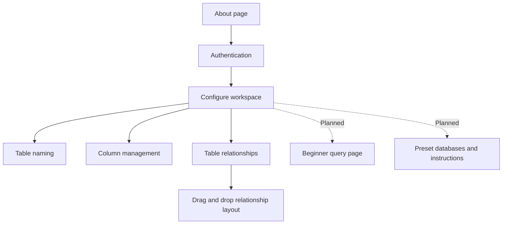

# Blocky

Blocky is a database development sandbox for creating efficient, maintainable, and future-proof database solution architectures.

## Overview

Blocky is designed to make database planning more approachable while keeping the structure of a project visible and easy to manage. The application combines authenticated access with a visual database configuration workspace.

## Website Structure

The current website is organized around the following experiences:

### About Page

The about page introduces Blocky and its purpose as a database development and sandbox platform.

### Authentication

The authentication flow protects application pages and supports secure account access. Authentication-related work currently includes:

- Password hashing
- Secret-based application configuration
- Authentication methods
- Page-access wrappers

### Configure Workspace

The configure page is the main database design workspace. Its current structure includes:

- **Table naming**: Create, manage, and delete database tables.
- **Column management**: Add, manage, and delete table columns.
- **Relationships**: Arrange relationships between tables using drag-and-drop interactions.

## Current Status

The current implementation includes the authenticated application foundation and the database configuration workspace structure. Blocky is being developed incrementally, with the visual design and database tooling expanding over time.

## Security Principles

Security is part of the application foundation rather than an afterthought.

- Passwords must be stored using hashing, never as plain text.
- Secrets and credentials must remain in protected environment configuration and must not be committed to the repository.
- Page-access protections should be applied to every restricted route and action.
- Documentation should use placeholders and examples instead of real credentials or connection strings.
- Database access should be limited to authenticated and appropriately authorized users.

No passwords, secrets, private connection strings, or other sensitive values are included in this README.

## Roadmap

The next planned additions are:

1. **Beginner query page**

	A guided custom query experience for users who are learning how to work with databases.

2. **Preset databases**

	Ready-made database structures accompanied by instructions to help users learn from practical examples.

## Project Direction

Blocky aims to provide a clear path from database experimentation to thoughtful solution architecture:

1. Understand the project through the about page.
2. Access the protected application through authentication.
3. Design the database structure in the configure workspace.
4. Manage tables, columns, and relationships visually.
5. Learn through guided queries and preset database examples as they are introduced.